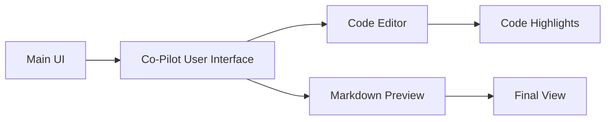

# Docs Co-Pilot
## Description
Adds support for markdown style of documents co-creation. This plugin designed to visualize diagrams with the mermaid syntax.
It also provides visual highlights for the code editor
## Usage
To run this extension follow these steps:
- Download and start main UI https://github.com/oobabooga/text-generation-webui
- Download this extension and place files into `extension` folder
- Then start server.py with the appropriate `--extensions docs_copilot` argument. Example:
```
python server.py --model-dir ..\models\7B\ --extensions docs_copilot
```
Then navigate to the Doc Copilot tab and start prompting the editor on your left. When you need an assistance you can click "Go" button. 

## Dependencies
- Mermaid (https://mermaid.js.org/)
- Ace editor (https://ace.c9.io/)- 
- Both librariles are loaded on the go from the Internet. If you like you can copy them to the local files and load locally.

## Demo
 

-------
## How it works
The overview for this plugin architecture: 

## Features
* Visualize diagrams with the mermaid syntax.
* Provides visual highlight for code editor
* Allows co-creation of documents in markdown format. 